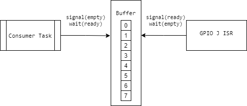

# Lab 05

The objective of this lab is to create a producer-consumer scenario 
with a producer ISR and a consumer task.

## Description

The idea is to have a GPIO ISR that for every push-button press
increments a global counter and signals the consumer task to consume
the value from a buffer.

The consumer task then displays the value read from the buffer on the
boards built-in LEDs.

## Debouncing

On inevitable issue that appears when dealing with push-buttons is
the debouncing them.

For that, I've added a delay of 800 ticks to the consumer task to better coordinate the counter increments.

